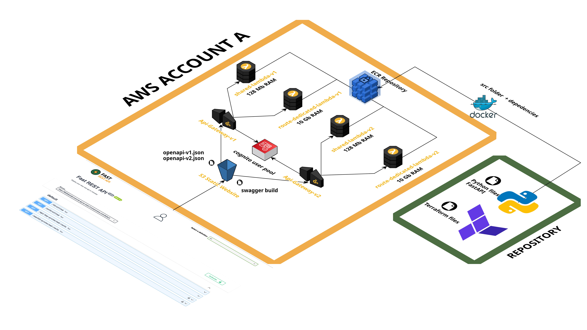
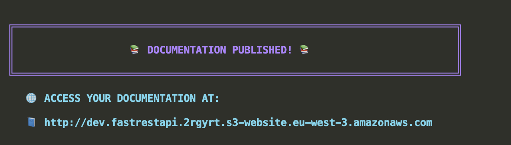
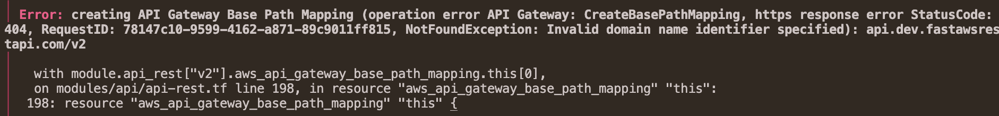
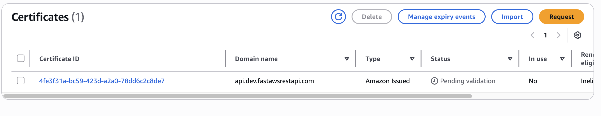
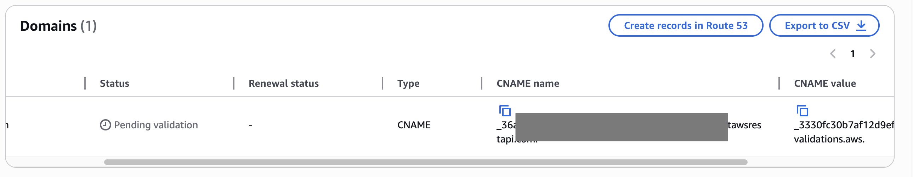
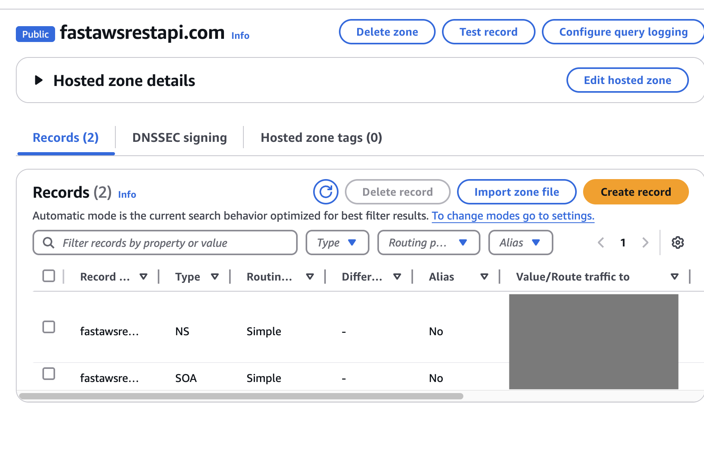
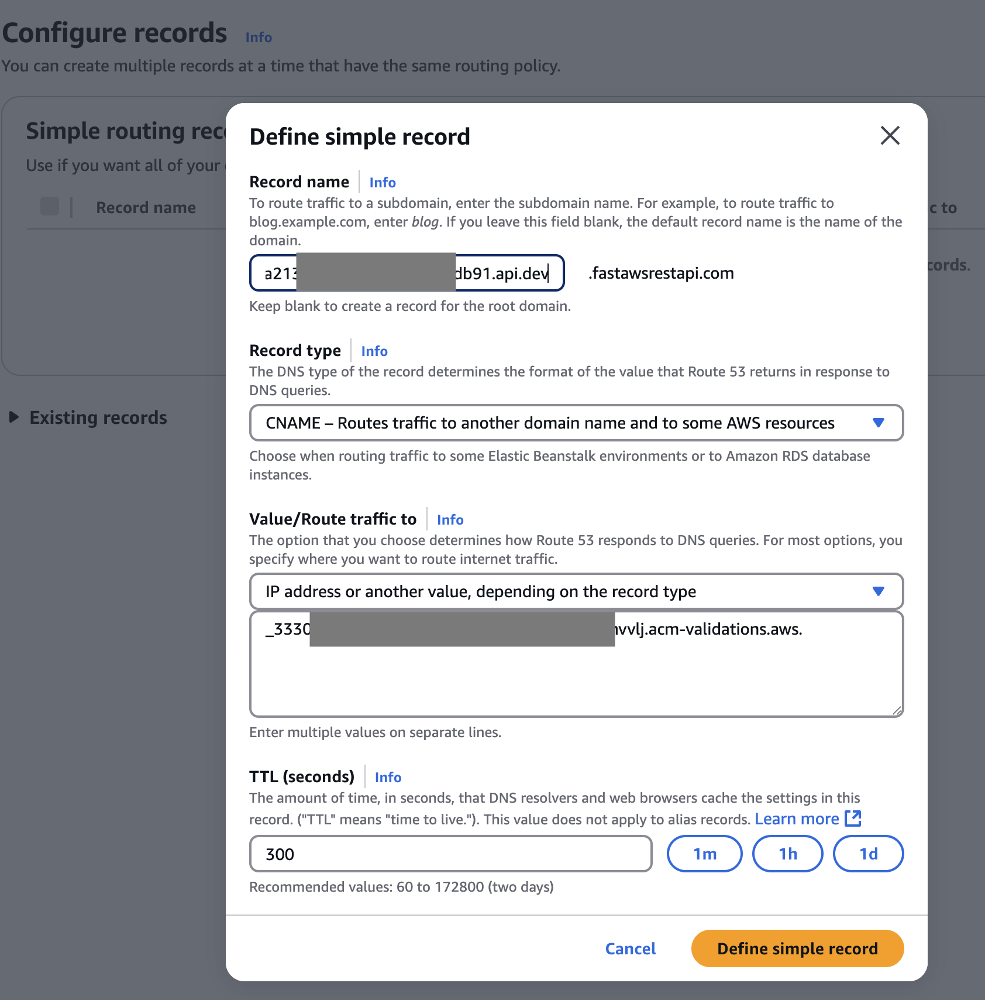

<p align="center">
  
</p>

<h2 align="center">FastAPI to AWS API Gateway (REST) Boilerplate</h2>

<p align="center">
  Deploy your FastAPI app on AWS API Gateway REST using Terraform + OpenAPI.<br>
  Includes hosted Swagger UI on S3 with custom domains and versioning.
</p>

<p align="center">
  <a href="https://www.python.org/"></a>
  <a href="https://fastapi.tiangolo.com/"></a>
  <a href="https://registry.terraform.io/"></a>
  <a href="https://docs.docker.com/"></a>
  <a href="https://github.com/sponsors/RemyNtshaykolo">
    
  </a>
</p>

## 🚀 Introduction

This boilerplate lets you deploy versioned FastAPI applications on AWS API Gateway (REST) with:

- OAuth2 & API Keys
- Throttling & burst limits
- Response caching
- Custom domain names
- Hosted Swagger UI for each version

It **automatically transforms** the default OpenAPI schema from FastAPI by injecting AWS-specific extensions — no manual editing needed.

## ✨ Features

- 🔐 **Auth & Usage Plans** – OAuth2, API Keys, Usage Plans
- 🚦 **Traffic Control** – Throttling and burst settings
- ⚡ **Response Caching** – Low latency, faster APIs
- 📚 **Multi-Version Docs** – Swagger UI hosted per version (on S3)
- 🌐 **Custom Domains** – Subdomain config per environment

## 🧰 Prerequisites

Install:

- [Terraform](https://developer.hashicorp.com/terraform)
- [UV](https://docs.astral.sh/uv/getting-started/installation/)
- [Docker](https://www.docker.com/)
- [Node.js](https://nodejs.org/)
- [Yarn](https://classic.yarnpkg.com/lang/en/docs/install/#mac-stable)

## ⚙️ Quickstart — Deploy in < 5 Minutes

### 1. 🔍 List Available Commands

```bash
make help
```

All commands follow this format: `make <command>-<stage>`  
In this tutorial, the dev environment is used.
_Example_: `make deploy-dev`

### 2. 📦 Install Python Dependencies

```bash
uv venv .venv
uv sync
```

### 3. 📦 Install nodes depedencies

```bash
yarn
```

### 3. 🔧 Configure AWS

Edit `config.py`:

```python
"aws_region": "eu-west-3",
"aws_accounts": {
    "dev": {
        "aws_account": "408566731358", # Your aws accound ID
        "profile": "fast-rest-api", # The aws profile you set for this account in your .aws/credentials file.
        "live": False # Wheter or not it is your production environment
    },
}
```

> Later on, you will be able to declare multiple stages (dev, staging, prod, etc.). The "live" parameter is primarily used for configuring custom domain names.
>
> For non-live environments, such as dev, the stage name is included in the URLs:
>
> | Stage       | API URL                     | Docs URL                        |
> | ----------- | --------------------------- | ------------------------------- |
> | dev         | `api.dev.fastawsrestpi.com` | `doc.api.dev.fastawsrestpi.com` |
> | prod (live) | `api.fastawsrestpi.com`     | `doc.api.fastawsrestpi.com`     |

### ✅ 4. Init Terraform

```bash
make tf-init-dev
```

> This command downloads the AWS providers and the necessary modules into the `.infra/.terraform` directory.
>
> It also creates a local directory `.infra/terraform/terraform.tfstate.d/dev` where the Terraform state will be stored. However, you can use any Terraform backend to store your Terraform state, such as S3 or Terraform Cloud. This can be specified in the `version.tf` file.

### 🧪 2. Create the ECR Repository

```bash
make tf-apply-ecr-dev
```

> Before building and pushing the Docker image for the Lambda function, it is necessary to create an ECR repository to store the Lambda image.
> Execute the command `make tf-ecr-dev` to apply the Terraform configuration specifically for the `aws_ecr_repository` resources defined in the `.infra/terraform/ecr.tf` file.

### 🐳 3. Build & Push Lambda Image

```bash
make build-push-lambda-image-dev
```

> This command builds your Docker image using the specified Dockerfile.
>
> You can find the original example [here](https://docs.astral.sh/uv/guides/integration/aws-lambda/#deploying-a-docker-image:~:text=other%20unnecessary%20files.-,>Dockerfile,-FROM%20ghcr.io).
>
> Note that an `aws_ecr_lifecycle_policy` is in place, which is useful for automatically removing untagged images.
>
> The API source code is located in the `src/api/` directory. For each version of your API, a subfolder exists in `src/api/versions`. In the initial version of this boilerplate, only two versions exists: v1 and v2.
>
> In theses folder you will find an app.py where a lambda handler (entrypoint for the lambdas) can be found. This entrypoint is used in `.infra/terraform/api.tf` folder.

### 📄 4. Generate OpenAPI Files

```bash
make generate-openapi-files-dev
```

> Use the command `make generate-openapi-files-dev` to generate the OpenAPI files for each version of your API. Two files are created for each version:
>
> - `openapi-<version>-terraform.json`: This file contains all routes, including those that are hidden.
>   It also includes an `x-amazon-apigateway-integration` configuration for each route and adds an OPTIONS route for every path to support
>   CORS in the documentation. Additionally, it sets the security schema for Oauth2Credentials with the correct format for Cognito user pool authorization.
> - `openapi-<version>-swagger.json`: This file is the default file generated by FastAPI. Hidden routes are not visible, and it will be used for documentation purposes.

### 5. Terraform apply

```bash
make tf-apply-dev
```

> This command apply the terraform configuration.
> It will deployed the following infrastructure.

<p align="center">
  
</p>

### 6. Deploy the api documentation on the previously created s3 bucket

```
make upload-openapi-files-to-s3-dev
```

> This command inserts the URL of the previously created API into the `servers` key of the `openapi-*-swagger.json` files. It then uploads these files to the previously created S3 bucket.

```
make build-swagger-ui-dev
```

> This command builds the swagger documenation

```
make publish-doc-dev
```

> This command upload push it to the previously created s3 bucket.
> The link of your api documentation should appear in the terminal
>
> <p align="center">
> 
> </p>

### 7. Test the api documentation

https://github.com/user-attachments/assets/cfb0dd69-28fe-4dd6-a279-7e91484f69f6


### 8. Use your custom domain name for your api

First make sure you have access to the dns record of your domain name.

Then in the config.py set the `use_custom_domain_name` to true and set `domain_name` to your domain name.

```python
"networking": {
        "domain_name": "fastawsrestapi.com", # Set your domain name here
        "use_custom_domain": True,  # Set this field to True
},
```


> You can execute the `make tf-apply-dev` command, but be prepared for it to initially fail. This is because it attempts to create a certificate for the custom domain name.
>
> For Amazon to verify domain ownership, you must add a temporary CNAME record to your DNS settings.
><p align="center">
>
></p>
> As mentioned earlier, you need to prove to AWS that you own the domain name.
>
> <p><strong style="font-size: larger;">Select the N. Virginia (us-east-1) region in your AWS account. Even if you specified a different <code>aws_region</code> in the config.py, certificates for EDGE APIs and CloudFront distributions must be created in the us-east-1 region.</strong></p>
>
> Then, navigate to the AWS Certificate Manager service, where you should see an ACM certificate registered for the domain name
>
> api.dev.yourdomainname.com, pending validation.
><p align="center">
>
></p>
>
> To validate, click on the certificate ID and retrieve the CNAME name and CNAME value.
><p align="center">
>
></p>
>
> Go to your domain name provider's settings (such as Ionos, GoDaddy, Gandi, Route53, etc.) and register a new CNAME record with these values.
>
> In this demonstration, an example is provided for Route53. Go to the hosted zone.
><p align="center">
>
></p>
> Click on "Create a new record" and select the simple routing policy.
> 
> Then click on "Define simple record."
> 
> Select the CNAME record type and add the CNAME record value from the ACM certificate manager.
> ⚠️ Depending on your domain provider, you might need to trim the end of the CNAME name.
>
> Example: _36acjkmlkfesslea0b889e4b4cfc96cdb91.api.dev.fastawsrestapi.com. => _36acjkmlkfesslea0b889e4b4cfc96cdb91.api.dev
> 
><p align="center">
>
></p>
>
> Then click on "Define simple record" and then "Create records."
>
> You will need to wait for the DNS to propagate. Once it is complete, the status of your certificate should change from "Pending validation" to "Validated."
> This usually takes around 5 minutes.
> 
